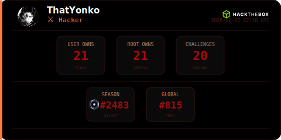

  

  
   
  

-----------------------------------------------------

  <table border="0">
    <tr>
      <td align="center" width="220">
         
        <code>[ CAPenX ]</code>
      </td>
      <td align="center" width="220">
         
        <code>[ eWPTXv3 ]</code>
      </td>
      <td align="center" width="220">
         
        <code>[ eWPTv2 ]</code>
      </td>
      <td align="center" width="220">
         
        <code>[ eJPTv2 ]</code>
      </td>
    </tr>
  </table>

  
  
  
  
  
  

>
